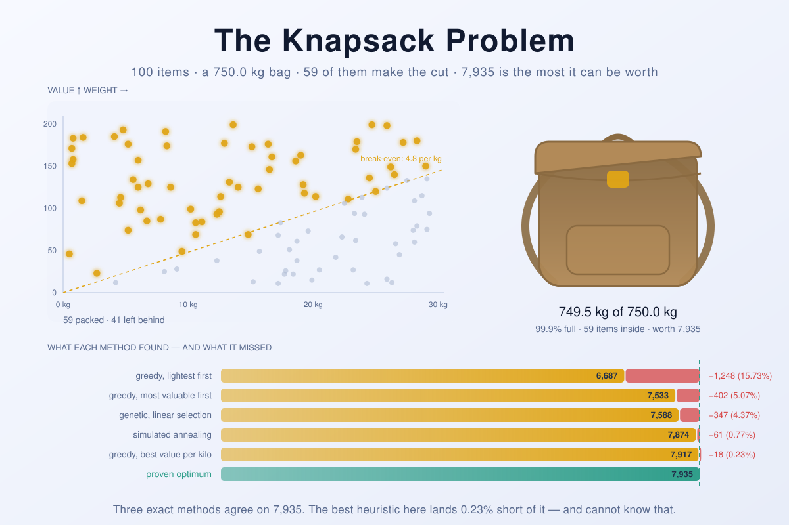

The Knapsack Problem
====================

A thief, a bag with a weight limit, and a hundred things worth stealing. Seven
ways to decide what goes in — three that are provably right, and four that only
think they are.

The interesting part is not finding a good answer. Sorting the loot by value
per kilogram and taking whatever still fits gets within a quarter of a percent
of perfect, in a fifth of a millisecond, and you could write it on a napkin.
The interesting part is *knowing* it got within a quarter of a percent. A
heuristic has no way to tell you how much it left on the table; it returns a
number and says nothing about the distance between that number and the truth.
So this repository runs the heuristics next to two dynamic programs and a
branch-and-bound search, all three of which return the genuine optimum by
completely different routes, and prints the gap. Every run cross-checks itself
and exits non-zero if the arithmetic ever disagrees.

That comparison is the thing the original version of this program could not
make. It had a genetic algorithm, three selection schemes, and — as it turned
out — an exhaustive search too slow to finish and a dynamic program that
returned bags heavier than the bag. See [History](#history).

<picture>
  <source media="(prefers-color-scheme: dark)" srcset="docs/banner-dark.svg">
  
</picture>

*(The banner is not decoration: which dots are lit, how full the bag is and the
length of every bar were all decided by running the solvers in this repository,
so the picture is the answer.)*

## Problem definition

There are `n` items, `x₁` to `xₙ`, where `xᵢ` has a value `vᵢ` and a weight
`wᵢ`. The bag carries a total weight of at most `W`. Values and weights are
non-negative. Choose a subset that maximises

```
  maximise    Σ vᵢ · xᵢ
  subject to  Σ wᵢ · xᵢ ≤ W ,  xᵢ ∈ {0, 1}
```

The `xᵢ ∈ {0, 1}` is the whole difficulty. Relax it to `0 ≤ xᵢ ≤ 1` — let the
thief saw things in half — and the problem collapses: sort by `vᵢ / wᵢ`, fill
the bag, slice whatever is straddling the top, done. That is the *fractional*
knapsack, and it is solved by a greedy rule in `O(n log n)` with no cleverness
at all. Insist that things go in whole and the problem becomes **NP-hard**; it
was one of Karp's original twenty-one.

The gap between those two facts is where every algorithm here lives. The
fractional answer is an upper bound you can compute instantly, and the integer
answer sits somewhere just below it — usually *just* below, which is why the
greedy rule looks so good and why proving anything about it is so much work.

## Requirements

**Java 17 or newer** — developed and tested on Homebrew's OpenJDK 21, and
nothing here is expected to break on later versions. No Maven, no Gradle, no
jar, no dependencies outside `java.base`. There is nothing to build:

```
java Rucksack.java
```

Java has been able to compile and run a single source file in one step since
Java 11 ([JEP 330](https://openjdk.org/jeps/330)), which suits a repository
that is one file. `javac` is only needed if you want the `.class` files.

Older releases are not supported. The program uses records, `switch`
expressions with arrow labels, and text blocks — all of which landed in Java 16
or earlier, but Java 17 is the first long-term-support release that has the
whole set, so that is the floor.

**On macOS**, `/usr/bin/java` is a stub that only knows how to tell you no JDK
is installed. Homebrew's is the easiest fix:

```
brew install openjdk@21
export PATH="/opt/homebrew/opt/openjdk@21/bin:$PATH"
```

That formula is keg-only — it installs nothing system-wide and needs no
password. If you would rather have a JDK that every terminal finds without a
`PATH` entry, `brew install --cask temurin@21` installs one properly, at the
cost of an admin prompt.

## Running it

```
java Rucksack.java
```

Options:

| Flag | Meaning |
| --- | --- |
| `-n N`, `--items N` | How many items to generate (default: `100`). |
| `-c KG`, `--capacity KG` | Bag capacity in kilograms (default: `items × 30 / 4`). |
| `-s S`, `--seed S` | Seed for the whole run (default: `2026`). |
| `--correlated` | Make every item worth what it weighs — the hard case. |
| `-m M`, `--method M` | `all`, `greedy`, `anneal`, `genetic`, `dp`, `branch`. |
| `--selection S` | `all`, `linear`, `roulette`, `tournament`. |
| `--generations G` | Genetic algorithm rounds (default: `20 × items`). |
| `--pool P`, `--elite E` | Population and survivor counts (default: `100`, `20`). |
| `--mutation R` | Share of offspring made by mutation rather than crossover (default: `0.7`). |
| `--steps N` | Annealing moves (default: `10 × generations × pool`). |
| `-q`, `--quiet` | Skip the item catalogue. |
| `-v`, `--verbose` | Trace the search on stderr. |
| `-h`, `--help` | Show usage. |

The packings go to **stdout** and the summary lines go to **stderr**, so the
results stay easy to pipe somewhere else. The exit code carries the verdict:
`0` every bag fits and no heuristic beat the optimum, `1` a cross-check failed,
`2` the command line was wrong.

```
$ java Rucksack.java --quiet
100 items weighing 1,631.9 kg and worth 10,340 in total; the bag holds 750.0 kg (46% of it), seed 2026, weights and values drawn independently.
method                           items       weight      value       gap       time
----------------------------------------------------------------------------------
greedy, lightest first              65     728.3 kg      6,687   -15.73%       0.6ms
greedy, most valuable first         51     747.8 kg      7,533    -5.07%       0.1ms
greedy, best value per kilo         59     749.5 kg      7,917    -0.23%       0.2ms
simulated annealing                 59     749.3 kg      7,874    -0.77%      91.1ms
genetic, linear selection           57     748.8 kg      7,588    -4.37%      64.0ms
genetic, roulette selection         54     739.6 kg      6,597   -16.86%      40.1ms
genetic, tournament selection       58     747.5 kg      7,484    -5.68%      30.2ms
dynamic programming, by weight      59     749.6 kg      7,935   optimal       4.1ms
dynamic programming, by value       59     749.5 kg      7,935   optimal       4.1ms
branch and bound                    59     749.5 kg      7,935   optimal       0.9ms
optimum 7,935 — 3 independent exact methods agree on it.
best heuristic: greedy, best value per kilo at 7,917, 0.23% short of it.
all 10 packings fit inside 750.0 kg.
```

Every number above is reproducible: `--seed` is threaded through item
generation and each stochastic method as a separate derived stream, so a
method's answer depends only on the seed and never on which other methods
happened to run first.

## The answer, and why greedy is so nearly right

**The best you can do with that catalogue is `7,935`, carrying `59` of the
`100` items at `749.5` of the `750.0` kilograms available.** Three algorithms
that share no code agree on it, which is the closest thing to a proof this
repository can offer.

The instructive part is the row above them. Sorting by value per kilogram and
taking greedily gets `7,917` — eighteen short, `0.23%`. That is not luck, and
it is worth understanding why, because it is also the reason the two
metaheuristics below it look so unimpressive.

Solve the *fractional* problem: sort by `vᵢ / wᵢ`, pour items in until the bag
is full, and let the last one be cut to fit. That answer is an upper bound on
the integer optimum, because any integer packing is also a fractional one. But
look at what the fractional solution is: a run of whole items, then **exactly
one** item sliced. Dantzig noticed this in 1957 and it has been the basis of
knapsack bounds ever since. Throw the sliced item away and you have a legal
integer packing that differs from the upper bound by less than the value of one
item.

With `100` items and a bag holding `59` of them, one item is worth roughly one
sixtieth of the load. So the greedy answer and the true optimum are trapped
within about `1.7%` of each other before anything clever happens at all, and in
practice the integer optimum recovers most of that by finding some small item
to fill the leftover space with. Lueker showed in 1982 that for random
instances this gap shrinks like `O(log²n / n)`, which is exactly the behaviour
on display: `0.23%` at `n = 100`.

The banner's dashed diagonal is that break-even rate — `4.8` of value per
kilogram, the density of the last item worth taking. Nearly everything above
the line is in the bag and nearly everything below it is not. **Nearly.** The
handful of exceptions near the line are the entire difference between `7,917`
and `7,935`, and finding them is what costs four milliseconds instead of two
tenths of one.

## The three exact methods

They exist to be redundant. Any one of them would give the answer; running all
three and comparing is what turns "the program printed a number" into "the
number is right".

**Dynamic programming, indexed by weight.** `best[w]` is the most value that
fits in `w` hectograms. Fold the items in one at a time, sweeping the capacity
axis *downwards* so that each item is offered to the bag exactly once — that
loop direction is the entire 0-1 constraint. `O(n · W)` time. It is called
*pseudo*-polynomial because `W` is a number written in the input rather than a
count of things: doubling the number of digits in the capacity squares the
table.

**Dynamic programming, indexed by value.** The same recurrence stood on its
head: `lightest[v]` is the least weight that buys a value of exactly `v`, and
the answer is the largest `v` whose cheapest packing still fits. `O(n · ΣV)`.
Which of the two is cheaper depends entirely on the numbers, and having both
makes the point better than a paragraph could: neither is polynomial, and
"pseudo-polynomial" is the careful word for either.

**Branch and bound.** Sort by density, then depth-first over "take it or leave
it", pruning any subtree whose fractional bound cannot beat the best packing
found so far. Because the density order makes the greedy prefix excellent, a
near-optimal incumbent appears in the first few nodes and the bound then cuts
almost everything: two hundred items are settled in **2,077 nodes** and two
thousand items in **3,783** — the tree barely grows, because the bound is doing
all the work. No table, no dependence on the capacity or the values. It is also
the one method here that can fall off a cliff — see below.

## The two metaheuristics, and what they are actually for

The genetic algorithm is what the original program was about, so all three of
its selection schemes are still here. What is new is that they can now be
graded, and the results are not flattering:

| Method | Value | Gap |
| --- | --- | --- |
| greedy, best value per kilo | `7,917` | `-0.23%` |
| simulated annealing | `7,874` | `-0.77%` |
| genetic, linear selection | `7,588` | `-4.37%` |
| genetic, tournament selection | `7,484` | `-5.68%` |
| genetic, roulette selection | `6,597` | `-16.86%` |

**Every genetic run loses to a sort.** Two things are going on, and both are
textbook.

*The plateau.* Watch a run with `-v`:

```
$ java Rucksack.java -q -m genetic --selection linear -v --generations 120
  gen     0  best     389  champion     199  mean     242
  ...
  gen    30  best   6,182  champion   5,927  mean   5,763
  ...
  gen    54  best   7,544  champion   7,527  mean   5,629
  gen    60  best   7,588  champion   7,588  mean   4,945
  ...
  gen   119  best   7,588  champion   7,588  mean   5,352
```

It climbs to `7,588` by generation sixty and then does not improve again — not
in the remaining sixty generations, and not in the nineteen hundred more that
the default run gives it. The reason is the shape of the search space. Near a
full bag, almost every single-bit mutation makes things worse: adding an item
overflows the capacity and scores zero, removing one throws value away. The
improving move is *remove this, then add that* — two flips, with a strictly
worse bag in between. Elitist truncation selection kills the intermediate
before the second flip can happen, so the population sits at a local optimum
that is one swap wide.

Simulated annealing exists in this repository as the control for exactly that
hypothesis. It is the same neighbourhood — flip one item — with one difference:
it accepts a worse bag with probability `exp(Δ/T)`, so it *can* walk through
the intermediate. It scores `7,874` against the genetic algorithm's `7,588`, on
a comparable time budget. That is the mechanism, demonstrated rather than
asserted.

*The roulette wheel.* Proportional selection draws parents with probability
proportional to fitness. Here the fittest bag in a mature population is worth
about `7,500` and the population mean sits near `5,600` — the trace above shows
both. A roulette wheel whose best slice is a third wider than the average one
is very close to a uniform draw, so the population gets almost no selection
pressure and drifts. This is the classic failure that fitness scaling and rank selection
were invented to fix; Goldberg and Deb's 1991 comparison of selection schemes
is where to read about it properly. Note that tournament selection, which cares
only about the *order* of fitnesses and not their ratios, beats roulette by ten
percentage points — which is precisely what that paper predicts.

None of this means genetic algorithms are bad. It means a genetic algorithm
with a bit-string genome, a single-flip mutation and no repair operator is a
poor fit for a tightly constrained packing problem, and that you cannot find
that out without an exact answer to compare against.

## What makes it hard

Everything above is measured on the easy case: weights and values drawn
independently. Value per kilogram varies by a factor of hundreds, so the
greedy order is enormously informative, the fractional bound is tight, and
branch and bound prunes the tree to nothing.

Now make every item worth what it weighs:

```
java Rucksack.java --correlated
```

`--correlated` generates the standard *strongly correlated* instance,
`vᵢ = wᵢ + 3 kg`. Nothing is a bargain, every density is nearly identical, the
fractional bound stops discriminating between subtrees, and the problem becomes
one of arithmetic on the last few grams. The dynamic programs do not care —
their running time depends on the capacity, not on the structure. Branch and
bound cares enormously:

| Instance | Nodes opened | Proved? |
| --- | --- | --- |
| `-n 200` uncorrelated | `2,077` | yes, 9 ms |
| `-n 2000` uncorrelated | `3,783` | yes, 5 ms |
| `-n 100 --correlated` | `189,401,756` | yes, 594 ms |
| `-n 200 --correlated` | `500,000,001` — budget exhausted | **no** |
| `-n 400 --correlated` | `19,371` | yes, 0.8 ms |

Read those rows in order. A hundred correlated items cost ninety thousand times
more nodes than two thousand uncorrelated ones. Two hundred correlated items
defeat the search entirely — left running without a budget it was still going
after a minute. Four hundred of them take under a millisecond. **Difficulty
here is not monotone in size**, and no amount of staring at `n` will tell you
which instance you have.

That is why `MAX_SEARCH_NODES` exists: the search gets five hundred million
nodes, and if it runs out it labels its answer `branch and bound, unproven`
rather than claiming a proof it does not have. The dynamic programs still
return the true optimum in milliseconds on all of these, which is the other
half of the argument for keeping more than one exact method around.
Pisinger's *Where are the hard knapsack problems?* is the survey of exactly
this behaviour.

## Other ways to solve it

**1. Sort and take.** *(`-m greedy`)* Three orderings are implemented, and the
spread between them makes the point: lightest-first lands `15.73%` short,
most-valuable-first `5.07%`, best-value-per-kilo `0.23%`. Note that greedy by
density alone has **no** approximation guarantee — one item of weight `W` and
value `W` against one of weight `1` and value `2` defeats it entirely. Taking
the better of *the greedy packing* and *the single most valuable item that
fits* is a genuine `½`-approximation, and it is one line more.

**2. Dynamic programming.** *(`-m dp`)* Both axes, as described above.
Bellman's, and old enough that "dynamic programming" was chosen as a name
partly because it sounded impressive to a hostile Secretary of Defense.

**3. Branch and bound.** *(`-m branch`)* Horowitz and Sahni's, in essence. Real
solvers go further: Pisinger's `minknap` works outward from the *core* — the
band of items near the break-even density, which is the only place the answer
is ever in doubt — and solves instances with millions of items.

**4. Meet in the middle.** Split the items in half, enumerate all `2^(n/2)`
subsets of each, sort one side by weight and binary-search it for the best
complement of each subset on the other. `O(2^(n/2) · n)` — also Horowitz and
Sahni, 1974. It is the method of choice when `n` is small but the weights are
enormous, exactly where both dynamic programs run out of memory. Not
implemented here because at `n = 100` it wants `2^50` subsets.

**5. An approximation scheme.** Round every value down to a multiple of
`ε·vₘₐₓ/n`, run the value-indexed dynamic program on the rounded values, and
the answer is guaranteed to be within `(1 − ε)` of optimal in `O(n³/ε)` time.
Ibarra and Kim, 1975; Lawler sharpened it in 1979. Deliberately not implemented
here, and for an honest reason: with values of at most `199` and `n = 100`, the
rounded table would be *larger* than the exact one. An FPTAS is a win when
values are astronomically large, which is not this instance — a good reminder
that asymptotic superiority and being the right tool are different claims.

**6. Hand it to a solver.** The problem is four lines of MiniZinc or a
one-constraint integer program, and CBC or HiGHS will dispatch it without
comment. That is what you should actually do at work. It is not what this
repository is for.

## History

The first version of this program was written for a university course, long
enough ago that its comments recommend disabling backtracking unless you have
"just rented a BlueGene/L". It was a single Java file with Polish identifiers —
`wyborObiektow`, `pakowanieDynamiczneProgramowanie`, `liczebnoscObiektow` — and
comments in ISO-8859-1 that had already lost their diacritics to a bad encoding
conversion somewhere along the way (`prawdopodobie?stwem`, `tudzie? 30 i
wi?cej`). It ran, and it printed plausible-looking numbers. It was also wrong in
several distinct ways, none of which it could possibly have detected, because
both of its exact methods were commented out in `main`.

**The memo key was a truncated `double`.** Weights were `double`s, and the
dynamic program indexed its memoisation table with `(int) weight` — so `5.1 kg`
and `5.9 kg` shared a cache slot, and a sub-solution computed with `5.1 kg`
already in the bag was happily reused when `5.9 kg` was. Over 200 random
18-item instances, that returned a bag heavier than the bag **27 times**,
overshooting by as much as `1.75 kg`, and disagreed with exhaustive search
**48 times**, once by `60` in value. This is the reason weights in the rewrite
are integers in hectograms and there is no floating-point capacity comparison
anywhere in the file.

**Tournament selection had one group.** The line that was meant to deal
individuals round-robin into groups read

```java
c = c < 39 ? c++ : 0;
```

`c++` evaluates to the *old* value of `c` and then assigns it back, so `c` is
zero forever. Every individual went into group 0, nineteen of the twenty groups
stayed empty, and each empty group returned its default winner — individual
zero. One generation of "tournament selection" replaced the entire elite with
twenty copies of the same bag. (The `39` is unrelated to any quantity in the
program, which is its own small mystery.)

**Roulette selection sampled from an array it was overwriting.** The wheel was
built from `pool`, and then the winners were written back into `pool[0..19]` in
the same loop — so by the tenth draw, half the indices on the wheel pointed at
individuals that no longer existed. The cumulative intervals were also
off by one each, `[lo, lo+fitness-1)`, leaving one unmatched integer per
individual where the search silently kept whatever was already there.

**`pool[-1]`.** The final "pick the best" loop started with `pos = -1` and only
updated it on strictly positive fitness. Any run where nothing legal was ever
found indexed the array at `-1`. It is not a hypothetical: `java Rucksack 1`
crashed with `ArrayIndexOutOfBoundsException` on five of six attempts.

**A fresh `Random` per call, in five places**, including inside the generation
loop — so nothing was reproducible and nothing could be compared across runs.

**And `O(n³)` where `O(n)` would do:** the greedy packers recomputed the entire
weight of the bag inside the inner loop of a scan that was itself inside a
`while (true)`.

The 2026 rewrite keeps the program's shape — one file, no build, a genetic
algorithm with three selection schemes — and changes everything underneath.
Weights became integers. Identifiers, comments and output became English. The
data became records, the algorithms became independent methods with Javadoc,
and the "to-do list, czyli main string args" became a real command line. Two
more algorithms joined: a second dynamic program indexed by value, and
simulated annealing as a control for the genetic algorithm's plateau. Most
importantly, the exact solvers were uncommented, made fast enough to leave
running, and pointed at the heuristics — so that for the first time the program
can say not just what it found, but how far off it was.

## Literature

The knapsack problem is not original to this repository, and it is one of the
most thoroughly studied problems in combinatorial optimisation.

**Where it comes from.** The greedy rule, the fractional relaxation and the
observation that the LP optimum has at most one fractional variable are all in
George B. Dantzig, ["Discrete-Variable Extremum Problems"](https://doi.org/10.1287/opre.5.2.266),
*Operations Research* **5**(2), 1957, 266–277. That the 0-1 version is NP-hard
is Richard M. Karp, ["Reducibility Among Combinatorial Problems"](https://doi.org/10.1007/978-1-4684-2001-2_9),
in *Complexity of Computer Computations*, Plenum, 1972, 85–103 — knapsack is
one of the original twenty-one. The dynamic-programming treatment goes back to
Richard Bellman, *Dynamic Programming*, Princeton University Press, 1957.

**The standard references.** Silvano Martello and Paolo Toth,
*Knapsack Problems: Algorithms and Computer Implementations*, Wiley, 1990 —
long out of print, freely available from the authors' department page, and
still the book to read for branch and bound. Hans Kellerer, Ulrich Pferschy and David
Pisinger, *Knapsack Problems*, Springer, 2004, is the modern successor and
covers every variant.

**Exact algorithms.** Ellis Horowitz and Sartaj Sahni,
["Computing Partitions with Applications to the Knapsack Problem"](https://doi.org/10.1145/321812.321823),
*JACM* **21**(2), 1974, 277–292, gives both the branch-and-bound scheme used
here and the `O(2^(n/2))` meet-in-the-middle method. David Pisinger,
["A Minimal Algorithm for the 0-1 Knapsack Problem"](https://doi.org/10.1287/opre.45.5.758),
*Operations Research* **45**(5), 1997, 758–767, introduces the core-based
`minknap`, which is what a serious implementation would use.

**Approximation.** Oscar H. Ibarra and Chul E. Kim,
["Fast Approximation Algorithms for the Knapsack and Sum of Subset Problems"](https://doi.org/10.1145/321906.321909),
*JACM* **22**(4), 1975, 463–468, is the first FPTAS; Eugene L. Lawler,
["Fast Approximation Algorithms for Knapsack Problems"](https://doi.org/10.1287/moor.4.4.339),
*Mathematics of Operations Research* **4**(4), 1979, 339–356, improves it.

**Why the easy case is so easy.** George S. Lueker, "On the Average Difference
between the Solutions to Linear and Integer Knapsack Problems", in *Applied
Probability — Computer Science: The Interface*, Birkhäuser, 1982, 489–504,
shows the expected gap between the fractional and integer optima of a random
instance is `O(log²n / n)` — the reason greedy lands within a quarter of a
percent above. Andrew V. Goldberg and Alberto Marchetti-Spaccamela, "On Finding
the Exact Solution of a Zero-One Knapsack Problem", *STOC '84*, 359–368, prove
random instances are solvable in expected polynomial time.

**Why the hard case is hard.** David Pisinger,
["Where are the hard knapsack problems?"](https://doi.org/10.1016/j.cor.2004.03.002),
*Computers & Operations Research* **32**(9), 2005, 2271–2284, is the survey of
instance classes — strongly correlated, inverse strongly correlated,
subset-sum, spanner — and of exactly the kind of non-monotone difficulty that
`--correlated` produces here.

**The metaheuristics.** John H. Holland, *Adaptation in Natural and Artificial
Systems*, University of Michigan Press, 1975, and David E. Goldberg, *Genetic
Algorithms in Search, Optimization and Machine Learning*, Addison-Wesley, 1989,
for the genetic algorithm and for fitness scaling. David E. Goldberg and
Kalyanmoy Deb, "A Comparative Analysis of Selection Schemes Used in Genetic
Algorithms", in *Foundations of Genetic Algorithms 1*, Morgan Kaufmann, 1991,
69–93, is the paper that predicts the tournament-beats-roulette result above.
Zbigniew Michalewicz and Jarosław Arabas, "Genetic Algorithms for the 0/1
Knapsack Problem", in *Methodologies for Intelligent Systems* (ISMIS '94),
LNCS 869, Springer, 134–143, works through penalty versus repair
representations — the repair operators this implementation deliberately does
without. Simulated annealing is Scott Kirkpatrick, C. Daniel Gelatt and
Mario P. Vecchi, ["Optimization by Simulated Annealing"](https://doi.org/10.1126/science.220.4598.671),
*Science* **220**(4598), 1983, 671–680.

**Where it escaped into the wild.** Ralph Merkle and Martin Hellman,
["Hiding Information and Signatures in Trapdoor Knapsacks"](https://doi.org/10.1109/TIT.1978.1055927),
*IEEE Transactions on Information Theory* **24**(5), 1978, 525–530, built a
public-key cryptosystem on the assumption that knapsack instances are hard.
They are — but not the ones with the trapdoor structure that scheme needed, as
Adi Shamir showed in
["A Polynomial-Time Algorithm for Breaking the Basic Merkle-Hellman
Cryptosystem"](https://doi.org/10.1109/TIT.1984.1056964), *IEEE Transactions on
Information Theory* **30**(5), 1984, 699–704. NP-hardness is a statement about
the worst case, and a cryptosystem needs its *average* case to be hard. That
distinction is the same one this repository keeps running into from the other
side: the instances it generates by default are, in the technical sense,
nowhere near hard enough.

## License

Released under the MIT License — see [LICENSE](LICENSE).
